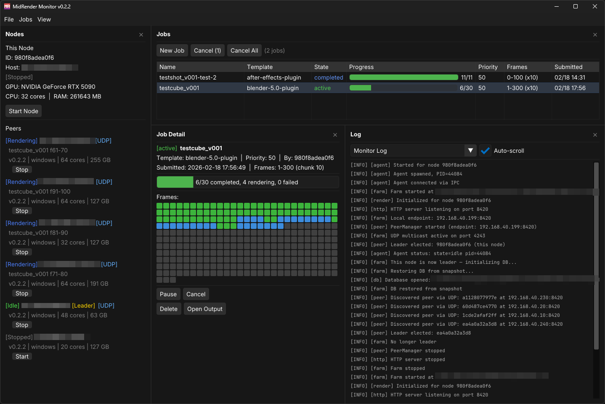
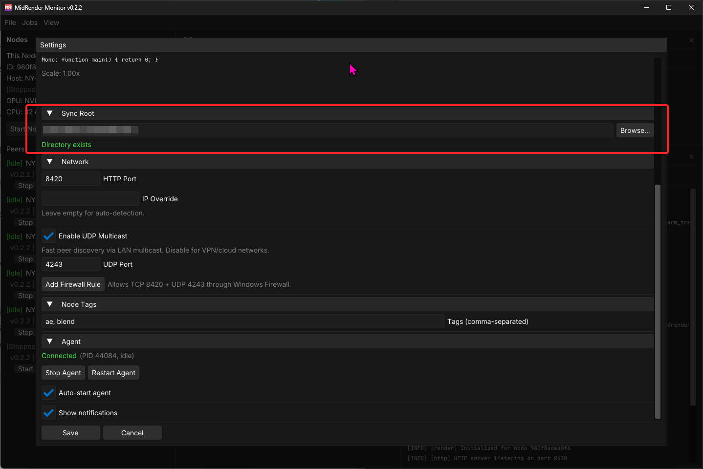
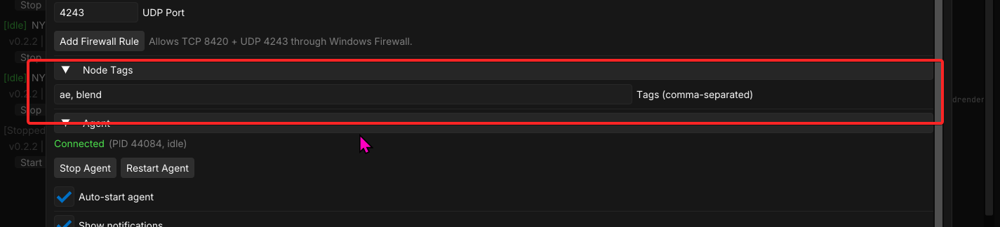
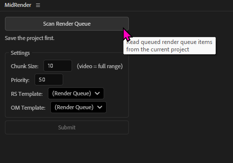
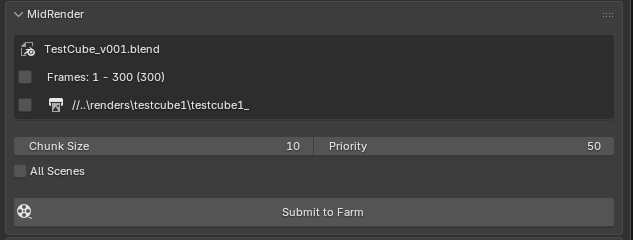

# Mid Render
A lightweight render farm coordinator for small/medium VFX teams and freelancers

Mid Render is a lightweight render farm coordinator with a simple install process and automated connectivity. It's a self-healing mesh system where each render node can act as a coordinator. If one drops out, another takes its place. It uses UDP for fast handshakes but falls back to a file-system-based "phonebook" to help connect nodes in VPNs and complex network scenarios. Job coordination is over http. 

It has a very simple job template setup that uses JSON templates to launch commands with flags, including regex hints for parsing stdout and tracking progress. It's DCC agnostic. Job templates and DCC submission plugins are included as examples. 

Each node has its own LiteDB database and collects snapshots of the current "leaders" state every 30 seconds. If the current leader drops out, a new leader takes over. The worst-case scenario: Frames rendered in the last 30 seconds will be re-rendered..

---

> ![NOTE]
> More advanced docs will come with later revisions, but here are the basics:

## Installation and Setup

Getting up and running is very simple. Download the latest `.exe` from releases and install on every node.

In the settings panel, browse to, or paste a shared directory that every node can access. This directory can be an SMB share on a NAS or a shared folder in a file sync service like LucidLink, Dropbox, Synology Drive, Resilio, Syncthing, or others. This folder will contain the "phonebook" that helps connect nodes and all logs (Mid Render logs and DCC output logs). Press Save.

> ![WARNING]
> This installer opens up the HTTP port 8420 and the UDP port 4243 in the Windows Firewall. Ensure you are comfortable with that before installing.

### Advanced Setup

#### Tags

Tags are how you filter which DCCs each node can render. You can also influence the "Leader" election process. Tags are comma-separated like: `ae, blend, leader`.

##### Options:

- `ae` is the tag used for the provided Adobe After Effect job template. Using this tag will allow After Effects rendering on this node.
- `blend` is the tag used for the provided Blender job templates.
- `leader` is a tag that forces leadership priority to a node. If this node is available, the mesh will recognize its leadership in coordination, but fall back to other nodes if it drops out.
- `noleader` signifies that you don't want this node to have leadership. It will only fall back to a leadership if it's the only node left alive.

---

## Post-Installation

You are ready to render now. You can create a new job in the MidRender Monitor application or install the optional DCC submitters.

### DCC Submitters

Browse to the shared folder you entered into the settings panel.

#### Adobe After Effects

In `plugins/afterEffects` is `MidRender.jsx`. Install this in your Adobe After Effects `Scripts/ScriptsUI Panels` folder. Press the `Scan Render Queue` to load all active Render Queue items. Set options and press `Submit`. 

> ![Note]
> Chunk size will be honored for all image sequences, but not video outputs. If you are outputting a video, the plugin will automatically set the chunk size to the video's duration so that a single video is rendered (and not multiple video chunks).

---

#### Blender

The MidRender submitter will automatically collect your render output frame range and output settings from the app, but you can toggle and adjust them for export. Press `Submit to Farm`.

---

