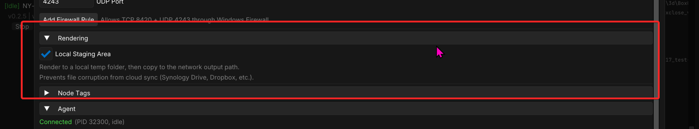
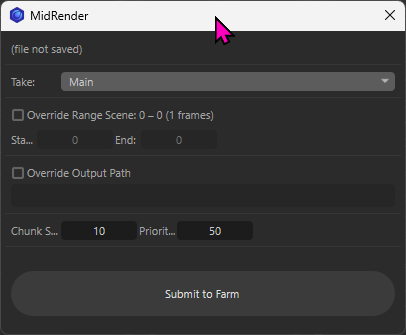
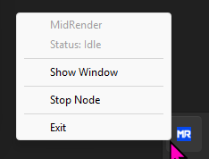

# MidRender

A lightweight render farm coordinator for small VFX teams and freelancers.

## Features

- **Self-healing mesh** — every node can act as coordinator. If the leader drops, another takes over automatically.
- **DCC agnostic** — JSON templates define how to launch any renderer. Ships with Blender, Cinema 4D, and After Effects templates + submission plugins.
- **Simple setup** — install, point every node at a shared folder, done.
- **Fast discovery** — UDP multicast for LAN, falls back to a file-system phonebook for VPNs and complex networks.
- **HTTP coordination** — job dispatch, progress tracking, and completion reporting over an HTTP mesh.
- **Local staging** — opt-in render-to-local-then-copy mode to prevent file corruption from cloud sync tools (Synology Drive, Dropbox, etc.).
- **Resilient** — each node keeps a SQLite snapshot of the leader's state. If the leader drops, a new one picks up where it left off. Worst case: frames rendered in the last 30 seconds get re-rendered.
- **Windows-first** — macOS and Linux support planned.

Built with C++, Rust, and [Dear ImGui](https://github.com/ocornut/imgui).

---

> [!NOTE]
> More advanced docs will come with later revisions, but here are the basics:

## Installation and Setup

Download the latest `.exe` from releases and install on every node.

> [!WARNING]
> The installer opens HTTP port 8420 and UDP port 4243 in the Windows Firewall. It also installs a shortcut in your startup folder.

In the settings panel, browse to or paste a shared directory that every node can access. This can be an SMB share on a NAS or a shared folder in a file sync service like LucidLink, Dropbox, Synology Drive, Resilio, Syncthing, or others. This folder holds the node phonebook and all logs (MidRender logs and DCC stdout logs). Press Save.

---

## Tags

Tags control which DCCs each node can render and influence leader election. Set them as comma-separated values in Settings (e.g. `ae, blend, leader`).

| Tag | Purpose |
|---|---|
| `ae` | Enables After Effects rendering on this node. |
| `blend` | Enables Blender rendering on this node. |
| `c4d` | Enables Cinema 4D rendering on this node. |
| `leader` | Forces leadership priority. The mesh prefers this node as coordinator, but falls back to others if it drops out. |
| `noleader` | Prevents this node from becoming leader unless it's the only one alive. |

---

## Local Staging Area

If you render to a synced folder setup (LucidLink, Dropbox, etc.), you'll want this option checked in the settings panel. Instead of rendering directly to the synced folder, it will create a temp staging area in `%localappdata%\MidRender`, render there, then move files to your final render folder. By staging renders like this, you avoid classic file contention issues on synced file services. 

---

## DCC Submitters

You can submit jobs directly from the MidRender app, or use the optional DCC plugins. Plugin files are in the shared farm folder under `plugins/`.

### After Effects

Install `plugins/afterEffects/MidRender.jsx` into your After Effects `Scripts/ScriptUI Panels` folder. Press `Scan Render Queue` to load active items, set options, and press `Submit`.

> [!NOTE]
> Chunk size is honored for image sequences, but not video outputs. For video, the plugin automatically sets chunk size to the full duration so a single file is rendered.

### Blender

Use `Install from Disk` in Blender's Add-ons settings. The MidRender submitter appears in the Render panels. It auto-collects your output and frame range settings, but you can adjust them before pressing `Submit to Farm`.

### Cinema 4D

Copy `plugins/cinema4d/MidRender.py` to your `%appdata%\Maxon\<C4D version>\library\scripts` folder. Run it from `Extensions > User Scripts > MidRender`. It pulls render paths and frame ranges from your scene settings. Press `Submit to Farm` when ready.

> [!NOTE]
> Cinema 4D has only been tested with a single license so far. It should work fine distributed across the farm though (famous last words).

---

## Minimize to Tray

When you close the app, it minimizes to the system tray. Running MidRender minimized on your render nodes is recommended — it disengages window drawing and releases resources to a minimal state, keeping only communication, coordination, and a lightweight Rust agent to manage render processes.

---

## Job Templates

Job templates are JSON files that tell MidRender how to launch a DCC's command-line renderer. They define the executable, argument structure, stdout parsing for progress, and submission defaults.

See the full reference: [Job Template Documentation](docs/job-templates.md)
